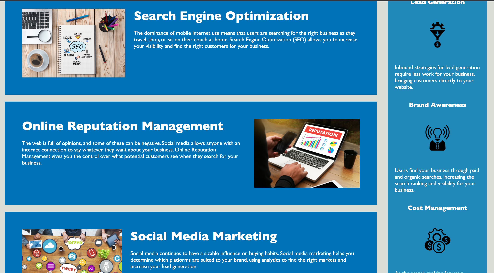

# Horizeon - SEO Project

## Usage

 
## Description
For this project, we were asked to improve the search engine optimization and accessbility of the above website.

## Search Engine Optimization
 To improve this site's SEO I first restructured the HTML to make it more semantically pleasing. Rather than divs with a class describing the section, i.e. "class='header'", I used the appropriate elements:
 header, nav, section, and footer. This creates a much more intuative structure for any other developers that may work on this project. This will allow for easier navigation of the document.

 Next, I added a concise, but descriptive title in the head of the html file. Following this is a meta tag with a description of the client's services. This will optimize search results by providing a short and to the point description in the search results.

## Performance
To increase the performance of the website I did the following:

 I reduced the resolution of the background-image.

 I cleaned up the css to be more efficient and concise. Fist, I elminated repetitive properties. If any properties were shared or could be placed in a parent element, I consolidated them. 
I also took out redundant classes in the main section because I could style everything based off the ids.

## Accessiblity
Some of the links needed to be fixed on the page so I provided the correct href so that users can be directed to the correct section.

Each image has an alt attribute describing the picture so that users using screen readers can understand what is displayed. This also describes the images to users if the images cannot load.

## Credits
Website design by Trilogy.

## Licenses
Open-sourced
